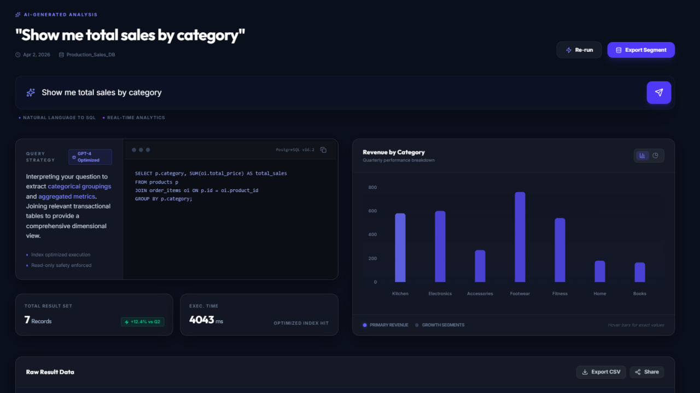

# 🛒 QueryCart — Natural Language Sales Dashboard

> Ask your database anything in plain English. QueryCart uses GPT-4o to instantly convert natural language into SQL, runs it on a live PostgreSQL database, and visualizes the results as interactive charts and tables.



---

## ✨ Features

- 🧠 **Natural Language to SQL** — Type plain English, get real data
- 📊 **Smart Visualizations** — Auto bar/line charts based on data shape
- 🔒 **SQL Injection Protection** — Validates all AI-generated queries before execution
- ⚡ **Real-time Results** — Live PostgreSQL queries with instant feedback
- 🎨 **Clean Dark UI** — Built with React + Tailwind CSS

---

## 🛠 Tech Stack

| Layer | Technology |
|-------|-----------|
| Frontend | React (Vite) + Tailwind CSS |
| Backend | Node.js + Express |
| Database | PostgreSQL (Supabase) |
| AI | OpenAI GPT-4o |
| Charts | Recharts |
| Deploy | Vercel + Render |

---

## 🏗 Architecture

```
User types question
      ↓
React Frontend (QueryInput)
      ↓
POST /api/query → Express Server
      ↓
GPT-4o (generates SQL from schema + question)
      ↓
SQL Validator (blocks DELETE, DROP, INSERT etc.)
      ↓
PostgreSQL (executes safe SELECT query)
      ↓
React renders ResultChart + ResultTable
```

---

## 💬 Example Queries

Try these in the dashboard:

```
Show me total sales by category
Which product has the highest revenue?
Show me monthly revenue for the last 6 months
How many orders were completed vs cancelled?
Top 5 customers by total spending
Which category has the most orders?
```

---

## 🗄 Database Schema

```sql
products      → id, name, category, price
orders        → id, customer_name, order_date, status
order_items   → id, order_id, product_id, quantity, total_price
```

---

## 🚀 Getting Started

### Prerequisites
- Node.js v18+
- PostgreSQL database (Supabase free tier works great)
- OpenAI API key

### 1. Clone the repo

```bash
git clone https://github.com/YOUR_USERNAME/querycart.git
cd querycart
```

### 2. Setup the database

- Create a free project at [supabase.com](https://supabase.com)
- Run the SQL from `schema.sql` in the Supabase SQL Editor

### 3. Setup the server

```bash
cd server
npm install
cp .env.example .env
```

Fill in your `.env`:
```
DATABASE_URL=your_supabase_connection_string
OPENAI_API_KEY=your_openai_api_key
PORT=5000
```

Start the server:
```bash
npm run dev
```

### 4. Setup the client

```bash
cd ../client
npm install
npm run dev
```

Visit `http://localhost:5173` 🎉

---

## 🔒 Security

- All AI-generated SQL is validated before execution
- Only `SELECT` queries are allowed — no `DELETE`, `DROP`, `INSERT`, `UPDATE`
- Database credentials are stored in environment variables, never exposed to the client

---

## 📁 Project Structure

```
querycart/
├── client/                 # React frontend
│   └── src/
│       ├── App.jsx
│       └── components/
│           ├── Header.jsx
│           ├── QueryInput.jsx
│           ├── SQLDisplay.jsx
│           ├── ResultChart.jsx
│           └── ResultTable.jsx
│
├── server/                 # Express backend
│   ├── index.js
│   ├── db/
│   │   └── index.js        # PostgreSQL connection
│   ├── agent/
│   │   ├── schema.js       # DB schema fed to GPT-4o
│   │   ├── generateSQL.js  # NL → SQL via GPT-4o
│   │   └── validateSQL.js  # Security validator
│   └── routes/
│       └── query.js        # POST /api/query
│
└── schema.sql              # Database schema + seed data
```

---

## 🧑‍💻 Author

Built by **Prodip**
- GitHub: [@Prodipsen27](https://github.com/Prodipsen27)

---

## 📌 Status

- ✅ Frontend: Complete
- ✅ Backend: Complete
- ✅ AI Integration: Complete
- ✅ Database: Complete
- 🟡 Deployment: In progress
